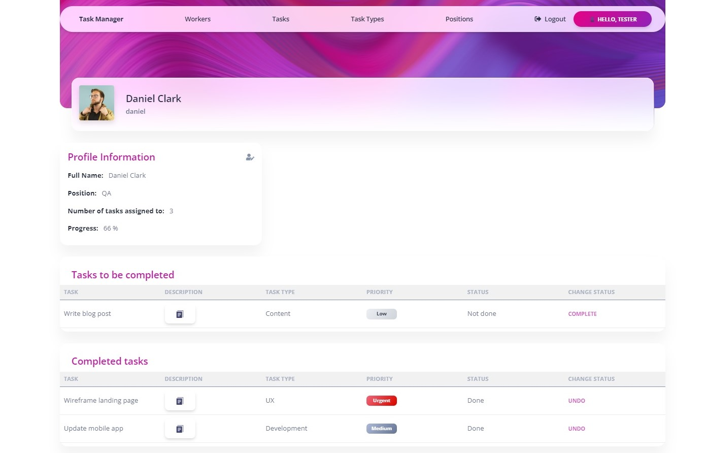

# Task Manager Project

A powerful tool for managing tasks and meeting deadlines.

## Try it out

[Task Manager project deployed to Render](https://task-manager-1efo.onrender.com/)

Use the following user to log in and check the functionality of the website: 

```shell
login: tester
password: test12345

## Installation 

Python3 must be already installed

```shell
git clone https://github.com/pavlejviki/task-manger
cd task-manager
python3 -m venv venv
source venv/bin/activate  # on macOS
venv\Scripts\activate  # on Windows 
pip install -r requirements.txt
python manage.py migrate
python manage.py runserver #starts Django Server
```

## Features

* Authentication functionality for Worker/User
* New tasks can be added and kept all in one list 
* Tasks can be delegated to certain workers and tracked
* Each worker has his own detail page with completed and uncompleted task displayed separately
* All tasks can be prioritised to manage time more effectively and  hit deadlines

## Demo



